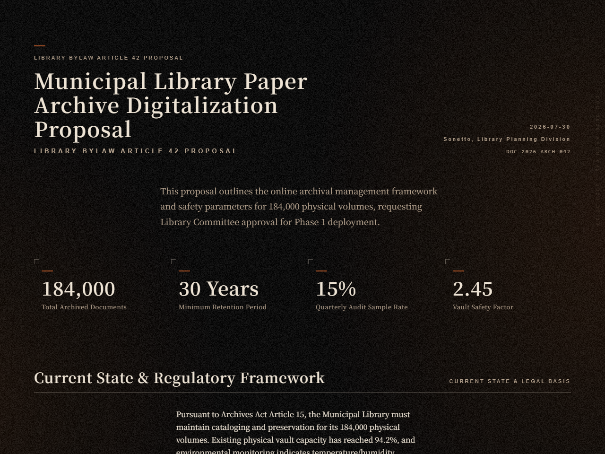
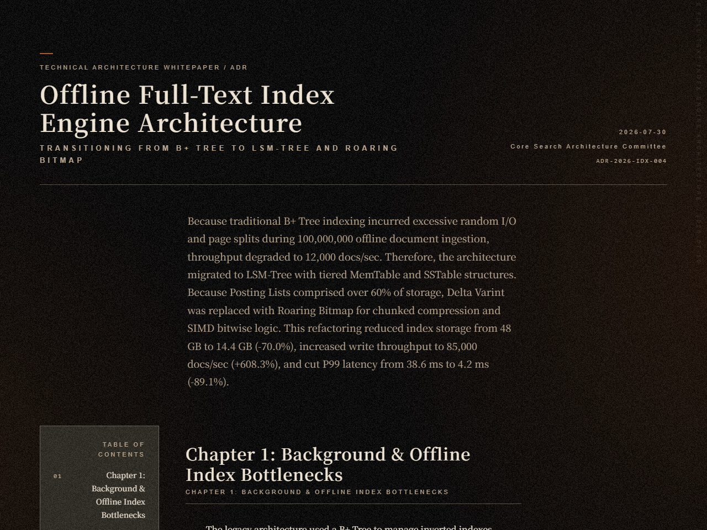
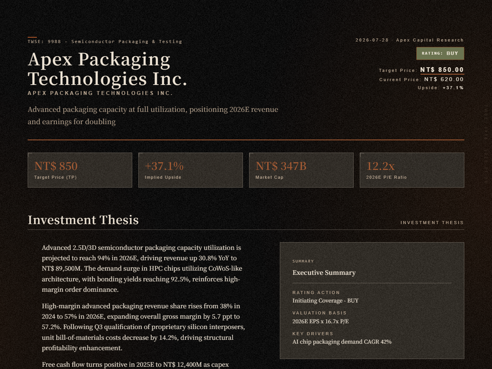
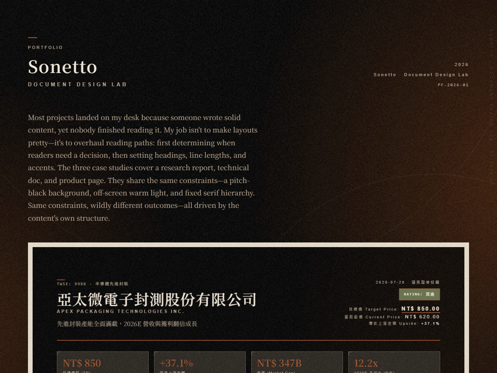
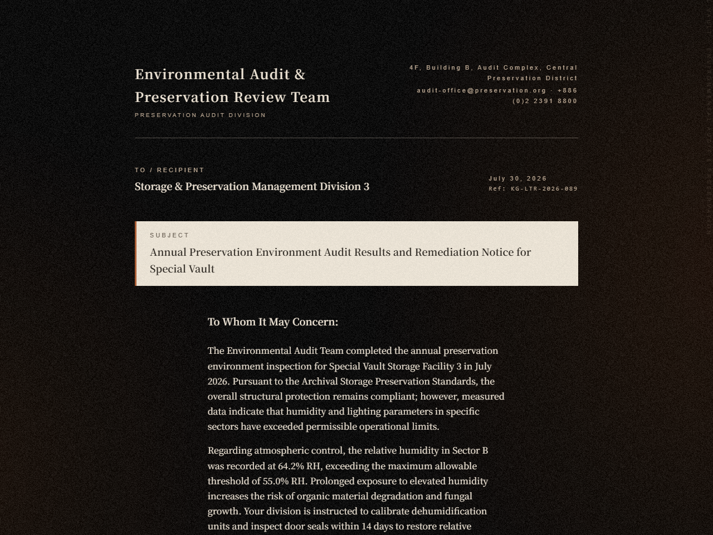
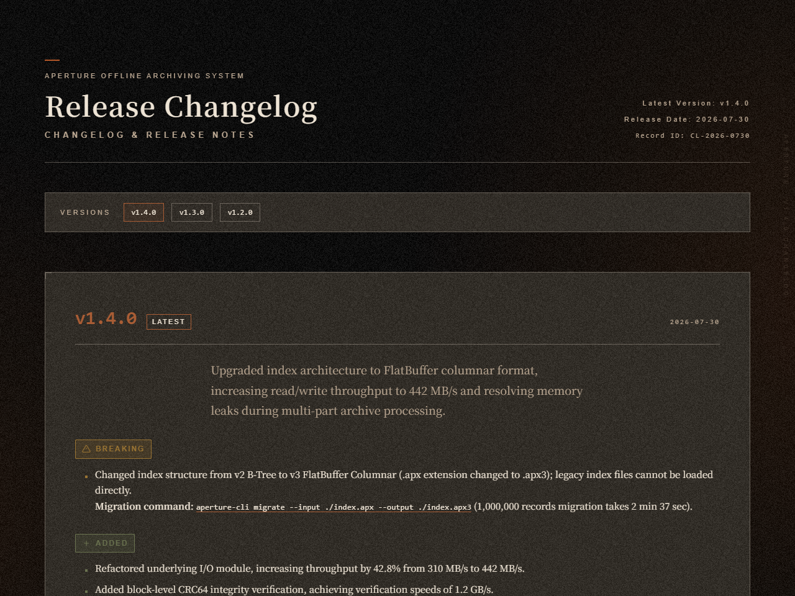
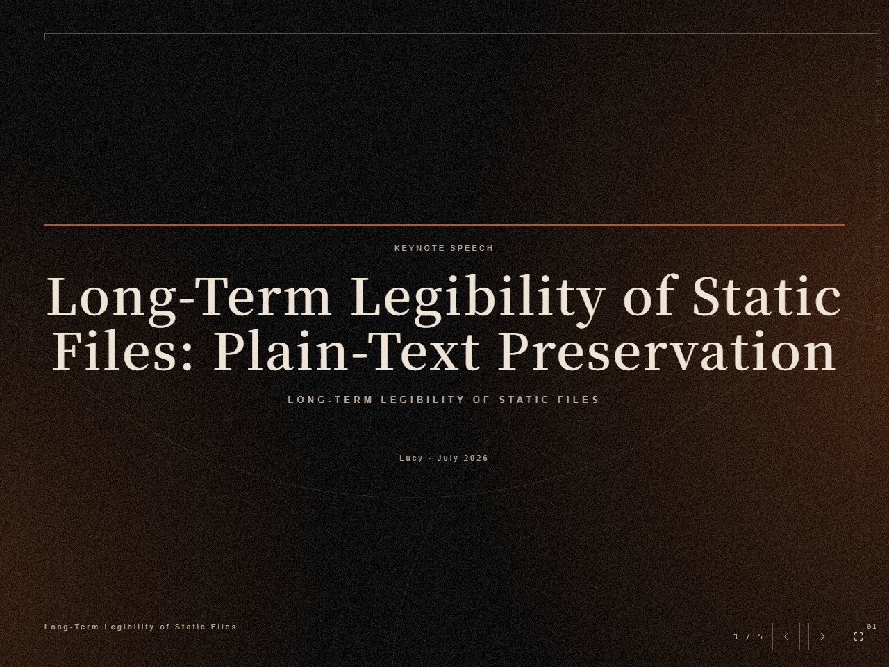
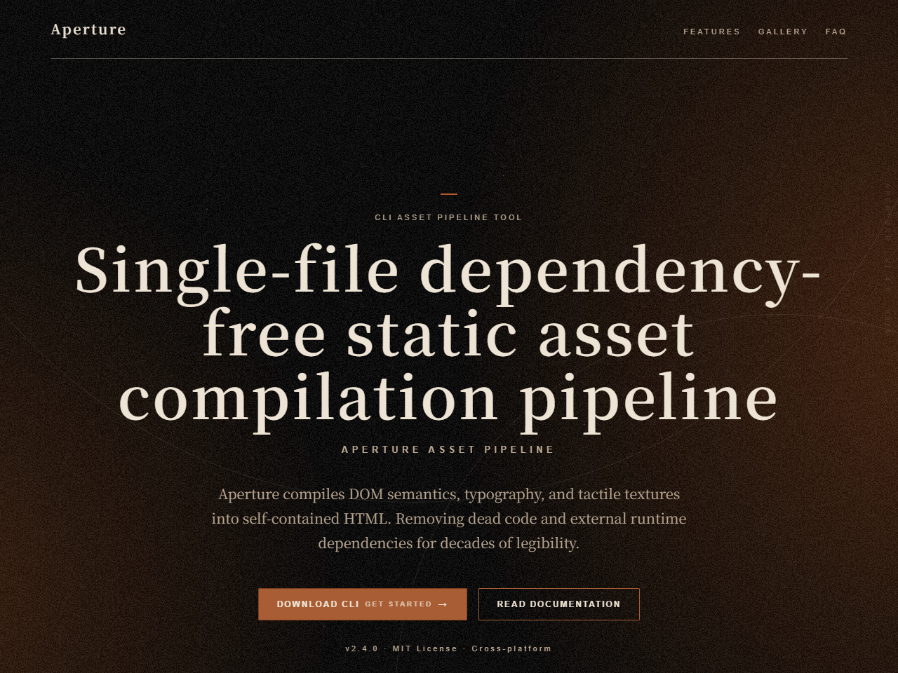

<div align="center">
  <h1>Kage</h1>
  <p><b>The light sits outside the frame. What stays is the shadow.</b></p>
  <a href="LICENSE"></a>
  <a href="assets/fonts"></a>
  <a href="SKILL.md"></a>
  <p><a href="README.zh.md">繁體中文</a></p>
</div>

## What is Kage?

Kage (影, かげ) is the trace light leaves behind. Give an AI agent a brief and it hands back a typeset HTML document: one-pager, long report, formal letter, portfolio, changelog, equity report, deck, product landing page. Eight in all.

What this design language reproduces is the weight of a well-made book settling into your hands. A matte surface, printed rules, controlled wear, the fibre your fingertip catches as a page turns. A screen has none of that, so the layers go back on one at a time until the sharpness has been worn off.

The light is anchored outside the frame. Only its falloff enters, so the centre sinks and the edges lift — the reverse of a camera vignette, because here the light never comes from the front. Text sits on the darkest part of the field and reads as ink pressed into paper.

Material carries the atmosphere; text carries the structure. That division is also a discipline: whatever must be clear on the page is not allowed to be buried under mood.

## Showcase

One document per type, every one a real render. Click a thumbnail to open the full file.

| Type | Preview | Ask for it like this |
|---|---|---|
| one-pager | [](assets/demos/demo-archive-proposal-en.html) | "Write me a one-pager: the city archive wants to move paper filing online" |
| long-doc | [](assets/demos/demo-index-engine-en.html) | "Turn the architecture decisions behind our offline full-text index engine into a long technical document" |
| equity-report | [](assets/demos/demo-packaging-equity-en.html) | "Put together an equity report on a semiconductor packaging firm — target price and downside risks included" |
| portfolio | [](assets/demos/demo-document-portfolio-en.html) | "Make me a portfolio of my document and typographic design work" |
| letter | [](assets/demos/demo-review-notice-en.html) | "Draft a formal notice: results of the annual preservation review" |
| changelog | [](assets/demos/demo-aperture-changelog-en.html) | "Turn these releases into proper release notes" |
| slides | [](assets/demos/demo-legibility-talk-en.html) | "Build a deck on the long-term legibility of static files" |
| landing-page | [](assets/demos/demo-aperture-site-en.html) | "Make a product landing page for this offline archiving tool" |

The right column is what to say to get a document of that kind — not the verbatim input behind each demo. Every company, person and figure in the demos is invented, and exists only to show the layout.

## Install

Put the repository where your agent can find a skill:

```bash
git clone https://github.com/workingyuanyuan/Kage.git
```

Then move the directory into the agent's skill path. The agent reads `SKILL.md` and opens the rest of the specs and templates as it needs them.

Two requirements:

| Requirement | Why |
|---|---|
| Node.js | The toolchain is plain Node with zero external dependencies |
| Chrome or Edge | Screenshots and pixel acceptance. Set `KAGE_CHROME` to the executable if it cannot be found |

## Usage

Once it is installed, just say what you want in plain language. **You do not name the type** — say what the document is for and the agent picks. It asks only when two types genuinely both fit.

```
Turn these meeting notes into a one-pager for my manager
```

Common ways to ask:

| What you want | Say something like |
|---|---|
| A proposal or exec summary that fits on one page | "Write me a proposal, one page only: \<topic\>" |
| White paper, technical document, annual wrap-up | "Turn this into a long technical document, two or three thousand words" |
| Formal letter, reference, resignation | "Draft a formal notice: \<subject\>" |
| Portfolio, case studies | "Make a portfolio out of these three projects" |
| Changelog, release notes | "Turn these releases into proper release notes" |
| Equity report, investment memo | "Write an equity report on \<company\>, with a target price and the risks" |
| Deck | "Build a deck on \<topic\>, about five slides" |
| Landing page, product site | "Make a product page for \<product\>, with pricing and an FAQ" |
| In Traditional Chinese | Add "in Chinese" to any of the above |
| Re-typeset something you already have | "This looks awful, lay it out properly" + paste the content or give a file path |

**Hand over whatever material you have.** Drafts, figures, brand logos, product screenshots — attach them or give paths.

**It will not invent what it does not have.** When a logo, product shot or figure is missing, the agent comes back once with a short gap list, and leaves the gap marked on the page as `[需要資料：…]` — no stock mood imagery, no redrawn approximations of a logo, no made-up numbers.

**What you get at handover**: the file path, which checks ran and what they said, every unfilled gap listed one by one, and a verdict on how the page looks at 1280 and 375.

**Say so if something looks off.** The agent names the element and its current value, then offers two options that are still within spec. If the same spot goes two rounds without landing, it stops nudging numbers and builds an A/B/C comparison for you to pick from.

### What runs before it calls the job done

The agent runs these itself; you do not need to remember them. They are listed so you know what "done" was checked against:

```bash
node scripts/kage.mjs check                       # shared CSS block, colour tokens, template lint, content contracts
node scripts/kage.mjs content <type> <draft.json> # semantic shape and length caps of a draft
node scripts/kage.mjs placeholders <finished>     # leftover {{}} and marked data gaps
node scripts/kage.mjs shot <file.html> --widths 1280,375
node scripts/kage.mjs shot <file.html> --bg-only  # background layer only
node scripts/kage.mjs bg <background.png>         # eight pixel checks on the background layer
```

Long documents and decks also come out frame by frame (`shot <file.html> --frames`). The reference frame for this design language is a single visible frame, never the full length of a document: stretch one light leak across 3900px and you get a composition no reader ever sees. So the correct image of a long document is N frames of equal height, each carrying the whole background — and of a deck, one frame per slide.

## Design

**Sixteen templates, one shared block of CSS.** Eight types across two language tracks. Each template is a self-contained file, and the shared block is verbatim identical across all sixteen, maintained and checked by a sync script. Verbatim means byte for byte — one character apart and it is reported as drift.

**Forty-five colour tokens, one source of truth.** All of them live in `references/tokens.json`. Every template's `:root` is compared against it, so a single mistyped hex in any one file gets caught.

**Four background layers.** A drawn base of `#000000` → a warm leak blended with `screen` → an optional central sink → grain in `normal` blend, always on top. Composited luminance lands near 12.8. The colour painted and the colour seen are two different things, a point the specs make over and over.

**Grain is static material.** A 200×200 greyscale PNG from a fixed seed, reproducible byte for byte. Composited luma standard deviation runs about 7.4 against a permitted 6 to 14. It does not flicker, shift, or respond to scrolling.

**The leak is graded by page tier.** Hue 18–30°, at 24%/19% for narrative pages, 15%/12% for structural ones, 10%/8% for reading ones. The core is anchored off-canvas and only the falloff appears on screen.

**Four decorative motifs.** Geometric hairlines and arcs, dust, mirrored ghosting, and edge cataloguing microtype. Arcs and broken scratches are mutually exclusive: one is a compositional vocabulary and the other a damage vocabulary, and layering them cancels both.

**Typography leads with serif.** `display` 64 → `h1` 44 → `h2` 30 → body 16px. Headings and body both run serif; sans is reserved for navigation, dates and numbering. The typeface is a self-hosted Noto Serif TC under the OFL.

**Content clears a contract first.** Each type has a JSON Schema fixing what must be present and how long it may run. A draft is validated before it reaches the template, so copy that would overflow the layout is stopped before it gets there.

**The background layer has eight pixel checks.** Grain strength, luminance distribution, hue and column evenness are invisible in the source and unreliable to the eye. These eight run pixel statistics over a screenshot: centre darker than edge, three luminance-area bands, grain standard deviation, achromatic channels, low-frequency residual, hue distribution, body-column evenness, and cross-shot stability.

**Two tone modes.** Standard is the default. Develop mode is rare and turns abstract claims into observable physical records; it only engages when asked for by name. Both modes share one quality bar, and switching relaxes nothing.

Screen-only delivery. MIT licensed, fonts under the OFL.

## Credits

The architecture took its cue from [Kami](https://github.com/tw93/kami), inheriting the modular idea of shipping document typesetting as an AI agent skill. The visual side runs on a different, dark analog language: a pure black base, a warm leak and film grain in place of the original light paper texture.

Thanks to tw93 and the Kami project for their open-source work.
