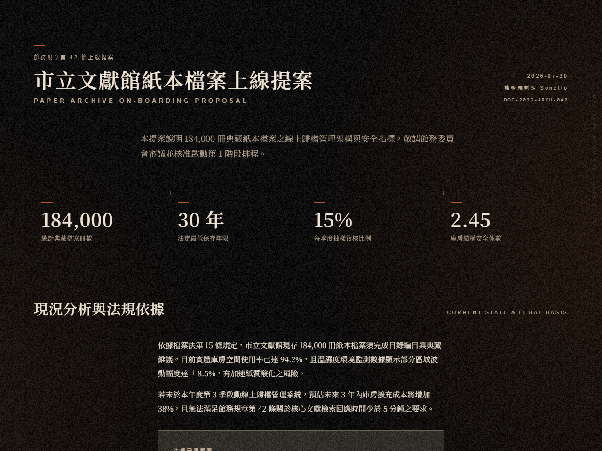
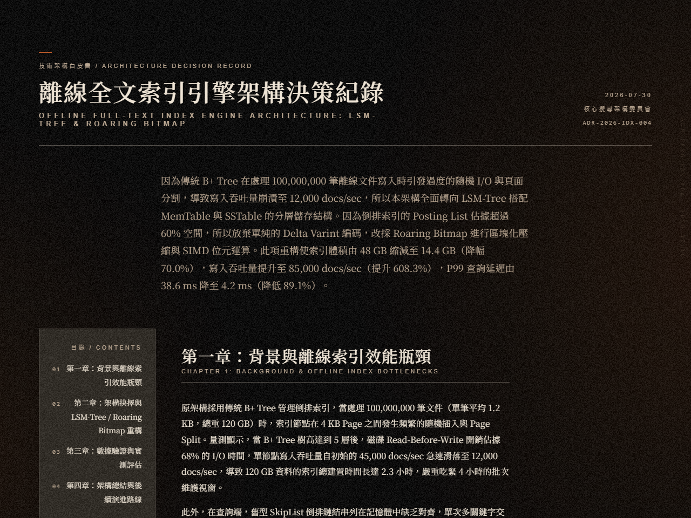
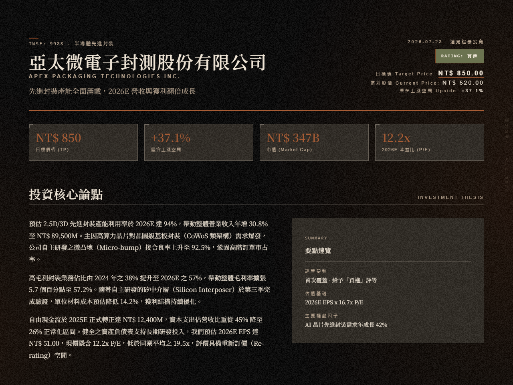
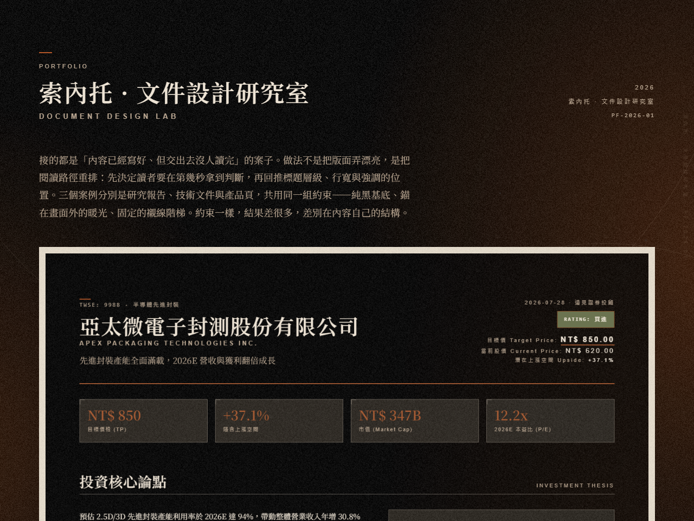
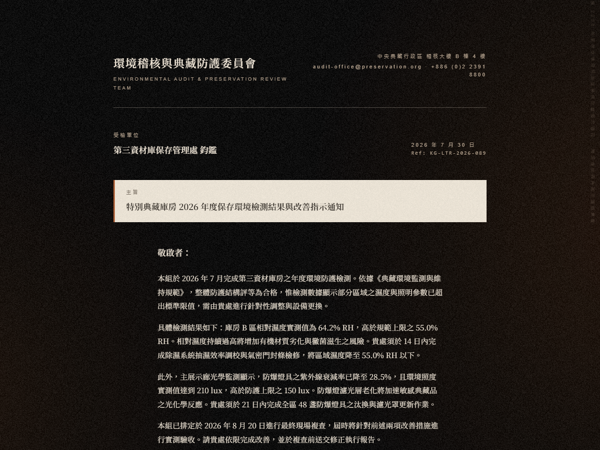
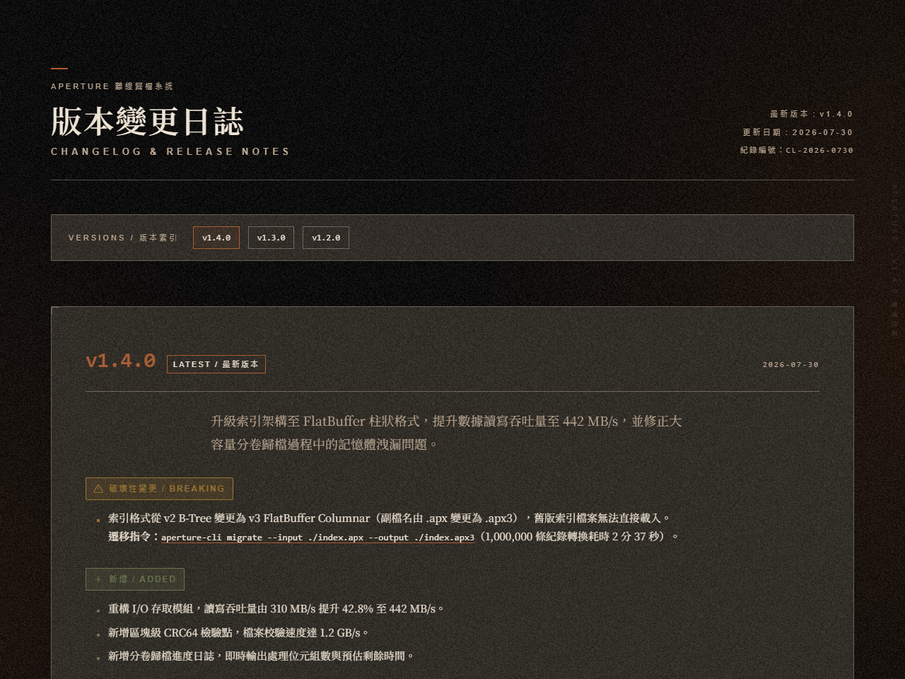
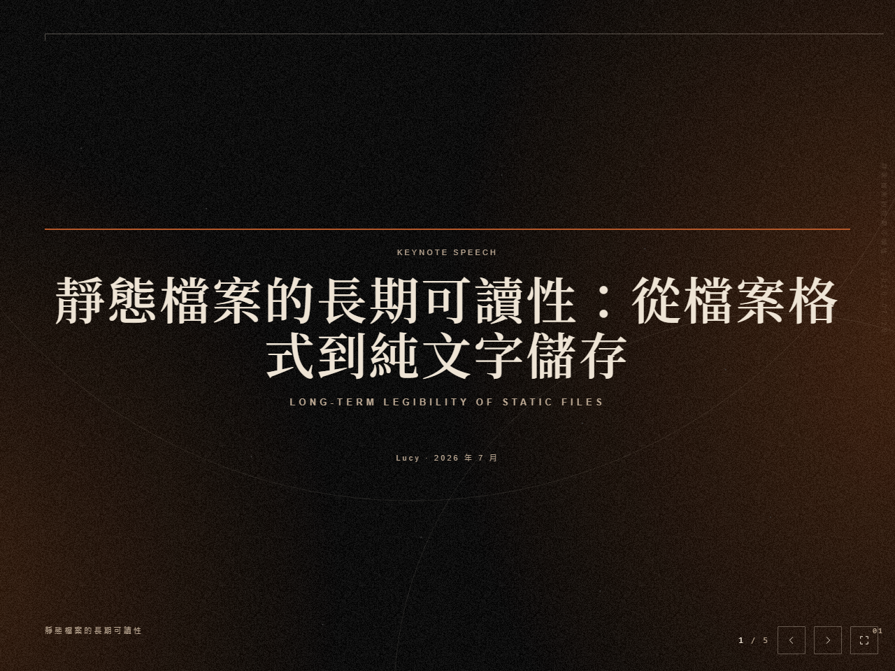
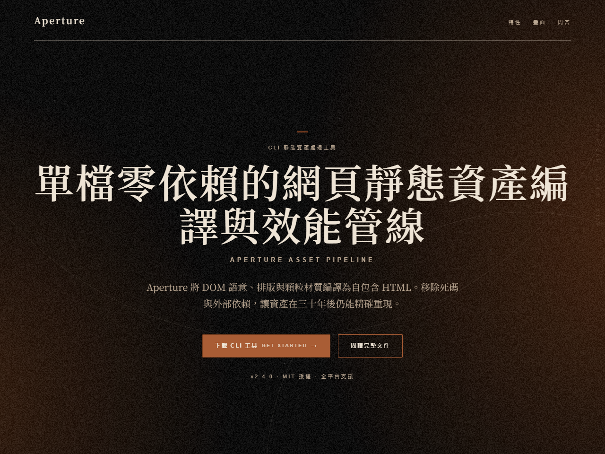

<div align="center">
  <h1>影</h1>
  <p><b>光在畫面外，影在畫面裡。</b></p>
  <a href="LICENSE"></a>
  <a href="assets/fonts"></a>
  <a href="SKILL.md"></a>
  <p><a href="README.md">English</a></p>
</div>

## 什麼是影？

影（kage，かげ）是光留下的痕跡。給 AI 代理一段需求，它交回一份排好版的 HTML 文件：單頁方案、長篇報告、正式書信、作品集、更新日誌、個股研報、簡報、產品落地頁，八種。

這套設計語言要重現的，是復古而精緻的紙質書與印刷品落在手上的重量。啞光的表面、印刷的線條、受控的磨損、翻頁時指腹感覺到的纖維。螢幕沒有這些，所以要把它們一層一層疊回去，直到畫面上的銳利被磨掉。

光源錨在畫面之外。畫面裡只看得到它衰減的尾端，於是中央沉暗、邊緣亮出——與相機的暗角相反，因為這裡的光從來不從正面來。文字落在最暗的那一塊，讀起來像油墨壓進了紙裡。

材質承擔氣氛，文字承擔結構。這是分工，也是紀律：版面上該清楚的地方不許被氣氛蓋掉。

## 展示

八種類型各一份，全是實際產出。點縮圖開完整文件。

| 類型 | 預覽 | 這樣說就會得到這一類 |
|---|---|---|
| one-pager | [](assets/demos/demo-archive-proposal.html) | 「幫我做份提案，一頁紙就好：市立文獻館要把紙本歸檔搬上線」 |
| long-doc | [](assets/demos/demo-index-engine.html) | 「把離線全文索引引擎的架構決策整理成一份技術長文」 |
| equity-report | [](assets/demos/demo-packaging-equity.html) | 「幫我做一份個股研報，標的是半導體封測廠，要有目標價和下行風險」 |
| portfolio | [](assets/demos/demo-document-portfolio.html) | 「做個作品集，收我這幾年的文件與排版設計案子」 |
| letter | [](assets/demos/demo-review-notice.html) | 「幫我寫一封正式通知信：保存環境的年度覆核結果」 |
| changelog | [](assets/demos/demo-aperture-changelog.html) | 「把這幾版的變更整理成 release notes」 |
| slides | [](assets/demos/demo-legibility-talk.html) | 「做一份簡報，講靜態檔案的長期可讀性」 |
| landing-page | [](assets/demos/demo-aperture-site.html) | 「幫這個離線歸檔工具做一個產品落地頁」 |

右欄是照著說就會得到同一類文件的說法，不是示範檔的逐字原始輸入。示範裡的公司、人物與數據全部虛構，只用於呈現版面。

## 安裝

把倉庫放到代理讀得到 skill 的位置：

```bash
git clone https://github.com/workingyuanyuan/Kage.git
```

接著把目錄移進代理的 skill 路徑。代理只讀 `SKILL.md`，其餘規格與模板由它按需開啟。

環境需求兩項：

| 需求 | 用途 |
|---|---|
| Node.js | 工具鏈全是純 Node，零外部依賴 |
| Chrome 或 Edge | 截圖與像素驗收。偵測不到時設 `KAGE_CHROME` 指向執行檔 |

## 使用

裝好之後就用平常說話的方式開口。**不必指定類型**——說用途，代理自己判斷要做成哪一種；只有兩種類型真的都成立時才會問你一句。

```
幫我把這份會議記錄整理成一頁紙，給主管看
```

常見的說法：

| 你想要的 | 這樣說 |
|---|---|
| 一頁講完的提案、執行摘要 | 「幫我做份提案，一頁紙就好：<主題>」 |
| 白皮書、技術文件、年度總結 | 「把這些整理成一份技術長文，兩三千字」 |
| 正式書信、推薦信、辭呈 | 「幫我寫一封正式通知信：<事由>」 |
| 作品集、案例研究 | 「做個作品集，收這三個案子」 |
| 更新日誌、版本紀錄 | 「把這幾版的變更整理成 release notes」 |
| 個股研報、投資備忘 | 「幫我做一份個股研報，標的 <公司>，要有目標價與風險」 |
| 簡報 | 「做一份簡報講 <主題>，大概五頁」 |
| 產品落地頁、官網 | 「幫 <產品> 做一個產品頁，要有定價和 FAQ」 |
| 英文版 | 上面任何一句加「用英文」 |
| 重排既有文件 | 「這份看起來太醜了，幫我排一下」＋貼上內容或給檔案路徑 |

**手上有的素材一起給。** 草稿、數據、品牌標誌、產品截圖，直接附上或給路徑。

**沒有的東西它不會編。** 缺標誌、缺產品圖、缺數字時，代理會回一張精簡的缺口表問你一次，並把缺口留在版面上標成 `[需要資料：…]`——不用無關的意境圖，不重繪近似標誌，不編造數值。

**交件時你會拿到**：檔案路徑、跑了哪些檢查與結果、還沒填的缺口逐條列出，以及 1280 與 375 兩個寬度的畫面結論。

**回饋就直說。** 覺得哪裡怪，代理會指名那個元素與它當前的值，給你兩個仍在規格內的選項；同一處調兩輪還沒過，它會改成做一張 A/B/C 對照圖讓你挑。

### 交付前會跑的檢查

這些是代理自己跑的，你不需要記。列出來是為了說清楚「完成」背後被驗過什麼：

```bash
node scripts/kage.mjs check                        # 共用 CSS 區塊、色彩 token、模板 lint、內容契約
node scripts/kage.mjs content <type> <稿件.json>    # 稿件的語意形狀與長度上限
node scripts/kage.mjs placeholders <完成的檔案>      # 殘留的 {{}} 與標記的資料缺口
node scripts/kage.mjs shot <檔案.html> --widths 1280,375
node scripts/kage.mjs shot <檔案.html> --bg-only    # 只有背景層的截圖
node scripts/kage.mjs bg <背景截圖.png>              # 背景層八條像素驗收
```

長文件與簡報另有逐框輸出（`shot <檔案.html> --frames`）。這套設計語言的參考框是單一可視框，不是文件總長度：一道漏光拉伸成 3900px，沒有任何讀者看得到那個構圖。所以長文件的正確影像是 N 個等高的框，每框各自帶完整的背景；簡報則是一頁一框。

## 設計

**十六份模板，一段共用的 CSS。** 八種類型乘兩個語軌。模板單檔自包含，那段共用區塊在十六份之間逐字一致，由同步腳本維護與校驗。逐字的意思是逐位元組——差一個字元就會被判為漂移。

**四十五個色彩 token，一個真相來源。** 全部收在 `references/tokens.json`，模板的 `:root` 與它比對，任何一份改錯一個色碼都會被檢查出來。

**背景四層。** 繪製基色 `#000000` → 暖色漏光以 `screen` 疊加 → 可選的中央沉暗層 → 顆粒以 `normal` 混合、永遠最上層。疊完的合成明度約 12.8。繪製下去的顏色與看到的顏色是兩件事，這一點在規格裡反覆強調過。

**顆粒是靜態材質。** 200×200 的灰階 PNG，固定種子產生，位元組層級可重現。疊加後的 luma 標準差約 7.4，規格容許 6 到 14。它不閃爍、不位移、不隨捲動變化。

**漏光依頁型分級。** 色相 18–30°，敘事型 24%/19%、結構型 15%/12%、閱讀型 10%/8%。核心錨定在畫面之外，畫面內只有衰減尾端。

**裝飾語彙四種。** 幾何細線與弧線、塵點、鏡像重影、邊緣編目微型字。弧線與斷續刮痕二選一：一個是構圖語彙，一個是損傷語彙，疊在一起會互相抵銷。

**排印由襯線主導。** `display` 64 → `h1` 44 → `h2` 30 → 正文 16px。標題與正文都走襯線，無襯線只承擔導覽、日期與序號。字型是自架的 Noto Serif TC，OFL 授權。

**內容先過契約。** 每種類型有一份 JSON Schema，規範該有哪些內容與各自的長度上限。稿子澆進模板之前先驗——會撐爆版面的字數在進版面之前就被擋下。

**背景層有八條像素驗收。** 顆粒強度、明度分布、色相、正文欄均勻度在原始碼裡看不出來，眼睛也不可靠。這八條對截圖取像素統計：中央須暗於邊緣、明度面積三帶、顆粒標準差、三通道無彩度、低頻殘差、色相分布、正文欄均勻度、跨截圖穩定度。

**兩種語氣模式。** 標準模式是預設。顯影模式罕用，把抽象宣示轉譯成可觀察的物理紀錄，必須明確指定才啟用。兩個模式共用同一套品質門檻，切換不放寬任何一條。

純螢幕交付。授權 MIT，字型 OFL。

## 鳴謝

架構的發想受 [Kami](https://github.com/tw93/kami) 啟發，承襲了把文件排版做成 AI 代理 skill 這個模組化的思路。視覺表達走的是另一套暗色類比語言：純黑基底、暖色漏光與膠片顆粒，替換了原本的淺色紙張質感。

謝謝 tw93 與 Kami 的開源工作。
